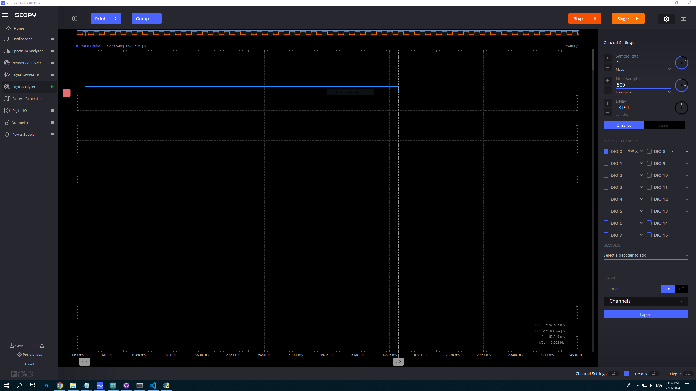

# Project8.1 - Two way communication between the computer and the Arduino board using firmataexpress

## Goals
1. Understand the firmataexpress package and its usage in actual project

## Instructions
1. Install the firmataexpress package in the Arduino IDE. upload the firmataexpress sketch to the Arduino board.
2. Install the [pymata4 package](https://mryslab.github.io/pymata4/install_pymata4/) in the python environment - pip install pymata4 
3. follow along with our demo ...

## Requirements

1. Develop a Python script that communicates with an Arduino device using the pymata4 library.
2. Set up a pin for digital input and monitor its changes.
3. React to button presses on the Arduino. When the button is pressed, perform an action (e.g., print a message, turn on an LED).
4. Initially, use the time.sleep() function to create a delay between button press checks. This version of the script should be named Reacting_button_press_pymata4_using_sleep.py. 
5. Modify the script to use a timer instead of time.sleep(). This will allow the script to perform other tasks while waiting for the button press. This version of the script should be named Reacting_button_press_pymata4_using_timer.py.
6. Add a Graphical User Interface (GUI) to the timer version of the script. The GUI should display the state of the button (pressed or not pressed) and any actions performed in response to the button press. plus, it should have a textbox input to accept different time intervals for the timer.

7. Handle any exceptions or errors that might occur during the communication with the Arduino.
8. Include comments explaining the functionality of each part of the code.
9. Write the script in a clean, organized, and efficient manner following good programming practices.

## Results ##
Paste a screenshot of the GUI here:

Paste a screenshot of the logic analyzer here that presents the time the LED is ON when pressing the button.

What is the difference between the two versions of the script? Which one is more user interactive and why?
## The first version with the sleep, doesn't include a gui, making it less interactive. In the first version, I didn't use any threading (e.g. we didn't use callbacks), meaning we can't add the gui to this version, as the gui needs a separate constant loop to work. We could add a calback that includes led on --> sleep --> led off, but this would lead to a very long callback, and this is not ideal because the threading here was done "under the hood", we don't really know how it was configured, and ideally will only be used for short, small tasks. threading.Timer was optimized specifically for this Purpose.

What can you say about the accuracy of the timing between the firmata version and your arduino code version?
which one is more accurate and why?
## In the firmata version the time it remains on is 62.6 [ms] when I asked it to remain on for 50 [ms]. In the arduino version (project 8, serial_led.ino) when I set the led to remain on for 50 [ms] it remained on for 50.1 [ms] (see screenshot below) which is much more accurate than the firmata version. The likely reason for this is that the signal transmisson "pathway" is less direct in the case of the firmata, meaning that more commands need to be executed in order to accomplish each task. Therefore, the time that elapses from the initial command to stop, to the moment when the led turns off, will be longer in the firmata version.

